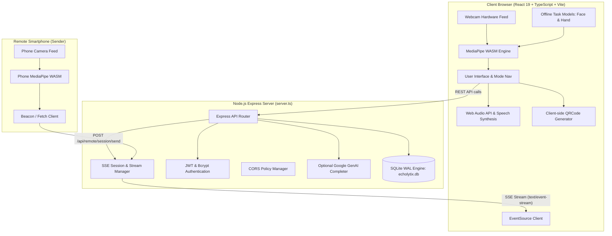

# EcholytiX — Comprehensive System Documentation & Technical Blueprint

> **"No voice should go unheard."**  
> **Official Repository:** [https://github.com/sachinguptaa056-gif/echolytix](https://github.com/sachinguptaa056-gif/echolytix)  
> **Version:** 1.0.0  
> **Runtime Environment:** Node.js (>= 22.5.0), React 19, TypeScript 5.8, Express 4, SQLite  

---

## Table of Contents

1. [Executive Summary & Motivation](#1-executive-summary--motivation)
2. [Clinical Context & Target Users](#2-clinical-context--target-users)
3. [System Architecture](#3-system-architecture)
4. [In-Browser Computer Vision & Classification Pipelines](#4-in-browser-computer-vision--classification-pipelines)
   - [4.1 Eye Blink-to-Morse Engine](#41-eye-blink-to-morse-engine)
   - [4.2 Sign Language Gesture Recognition](#42-sign-language-gesture-recognition)
   - [4.3 Manual Tap Morse Translator](#43-manual-tap-morse-translator)
   - [4.4 Remote Camera Sensor Pipeline (Smartphone Wireless Mode)](#44-remote-camera-sensor-pipeline-smartphone-wireless-mode)
5. [User Interface & Design System](#5-user-interface--design-system)
6. [Backend Server & Real-Time SSE Architecture](#6-backend-server--real-time-sse-architecture)
7. [Database Schema & Persistence Layer](#7-database-schema--persistence-layer)
8. [Complete REST & Streaming API Reference](#8-complete-rest--streaming-api-reference)
9. [DevOps, Build Pipelines & Deployment](#9-devops-build-pipelines--deployment)
10. [Hardware Management & Resource Safety](#10-hardware-management--resource-safety)
11. [Privacy, Security & Ethical Architecture](#11-privacy-security--ethical-architecture)
12. [Project File Hierarchy & Component Directory](#12-project-file-hierarchy--component-directory)

---

## 1. Executive Summary & Motivation

**EcholytiX** is an open-source, production-ready assistive communication system engineered to restore independence for non-verbal individuals and patients experiencing severe motor impairments. 

Traditional augmentative and alternative communication (AAC) devices typically cost upwards of thousands of dollars, require specialized hardware eye-trackers, or rely on invasive sensor headgear. EcholytiX overcomes these barriers by running **100% in any modern web browser** across consumer hardware (laptops, desktops, tablets, and smartphones) using standard webcams and on-device machine learning models.

### Key Pillars
- **Zero Video Egress:** All facial landmarking, hand tracking, and gesture inference execute locally inside client WebAssembly (WASM) runtimes. No camera images or video frames are ever transmitted over the network.
- **Multimodal Flexibility:** Accommodates patients with varying residual motor abilities (eye blinks, hand gestures, finger motion, or subtle physical taps).
- **Separable Remote Camera Architecture:** A smartphone can function as an external, repositionable camera sensor, streaming classified inputs to a bedside laptop without cables.
- **Real-Time Auditory & Visual Feedback:** Interactive sound synthesizers (frequency beeps and Web Speech TTS) provide immediate confirmation of every action.

---

## 2. Clinical Context & Target Users

EcholytiX is specifically tailored to assist patients diagnosed with:
- **Amyotrophic Lateral Sclerosis (ALS / Lou Gehrig's Disease)**
- **Locked-in Syndrome (LIS)**
- **Severe Cerebral Palsy (CP)**
- **Brainstem Stroke & Traumatic Brain Injury (TBI)**
- **High Spinal Cord Injury (Quadriplegia / Tetraplegia)**
- **Temporary Post-Surgical Intubation or Laryngeal Trauma**

Depending on the progression of motor loss, users or clinical caregivers can activate the optimal interaction mode:
- **Eye Blink Mode:** For locked-in patients who retain voluntary eyelid movement.
- **Sign Language Mode:** For deaf, mute, or stroke patients with partial or full hand dexterity.
- **Morse Tapper Mode:** For patients with minimal residual finger or foot pressure tapping capacity (compatible with standard Bluetooth switches).
- **Remote Sensor Mode:** Allows mounting a lightweight smartphone directly onto a wheelchair or bedframe, pointed at the user's face or hand, streaming results to a larger laptop display.

---

## 3. System Architecture

The project employs a unified full-stack architecture combining a Vite-powered React 19 single-page application (SPA) with an Express 4 backend operating SQLite with Write-Ahead Logging (WAL).



---

## 4. In-Browser Computer Vision & Classification Pipelines

### 4.1 Eye Blink-to-Morse Engine (`BlinkToText.tsx`)

#### Landmarking
The engine loads the Google MediaPipe Face Landmarker model (`face_landmarker.task`) inside a web worker utilizing the WebAssembly binary (`vision_wasm_internal.wasm`).

#### Eye Aspect Ratio (EAR) Math
For each eye, six key anatomical landmarks are tracked:
- Left Eye: `[362, 385, 386, 387, 263, 373, 374, 380]`
- Right Eye: `[33, 158, 159, 160, 133, 153, 154, 145]`

The vertical distances $V_1, V_2$ and horizontal distance $H$ determine the instantaneous Eye Aspect Ratio:
$$\text{EAR} = \frac{\|P_2 - P_6\| + \|P_3 - P_5\|}{2 \cdot \|P_1 - P_4\|}$$

#### Adaptive Baseline & Noise Filtering
1. **Adaptive Moving Average Baseline:** Rather than using rigid global thresholds that fail for naturally narrow eyes, the system dynamically calculates a running open-eye baseline over 30 frames.
2. **Relative Drop Detection:** A blink is registered when EAR drops below $65\%$ of the user's calibrated baseline for at least 80 milliseconds.
3. **Symbol Classification:**
   - **Dot (`.`):** Blink duration between $80\text{ ms}$ and $350\text{ ms}$.
   - **Dash (`-`):** Blink duration exceeding $350\text{ ms}$.
   - **Backspace / Delete:** Sustained single-eye wink ($> 1200\text{ ms}$) on the dominant eye.
   - **Auto-Commit:** Inactivity timer ($1800\text{ ms}$, user-configurable) commits the Morse character buffer into the active spelling word.

---

### 4.2 Sign Language Gesture Recognition (`SignLanguage.tsx`, `gesture.ts`)

#### 3D Skeletal Vector Geometry
The hand tracking engine samples 21 three-dimensional skeletal landmarks per hand:
- `Wrist (0)`
- `Thumb (1-4)`
- `Index (5-8)`
- `Middle (9-12)`
- `Ring (13-16)`
- `Pinky (17-20)`

#### Extension Angle & Joint Calculation
Each finger's state (Extended vs. Curled) is computed through cosine similarity of consecutive phalanx vectors:
$$\cos(\theta) = \frac{\vec{v}_{PIP-MCP} \cdot \vec{v}_{TIP-PIP}}{\|\vec{v}_{PIP-MCP}\| \|\vec{v}_{TIP-PIP}\|}$$

A live diagnostic bar visualizes the physical state of all 5 digits in real time, matching them against known alphabet signs (A–Z, space, delete, thumbs up, peace, open palm).

---

### 4.3 Manual Tap Morse Translator (`MorseTranslator.tsx`, `morse.ts`)

For users with physical switch access or minimal motor capabilities:
- **Input Channels:** Direct on-screen tap button, physical keyboard spacebar, or external Bluetooth assistive switch.
- **Timing Logic:** Real-time measuring between `pointerdown`/`keydown` and `pointerup`/`keyup`.
- **Classification:** Tap durations $< 250\text{ ms}$ register as dots; durations $\ge 250\text{ ms}$ register as dashes.
- **Sidetone Feedback:** An internal Web Audio oscillator generates an authentic $750\text{ Hz}$ sine wave tone for the exact duration of each touch.

---

### 4.4 Remote Camera Sensor Pipeline (`RemoteReceiver.tsx`, `RemoteSender.tsx`, `server.ts`)

The remote module enables any smartphone (iOS / Android) to serve as a remote camera sensor for the patient:

1. **Session Generation:** The laptop receiver calls `POST /api/remote/session/create` to allocate an active 6-digit session code.
2. **Offline Local QR Code:** The receiver utilizes the browser-side `qrcode` engine to generate a high-contrast data URL pointing to `/?remote-sender=true&code=XXXXXX`.
3. **Network Priority Detection:** The server inspects network interfaces (`os.networkInterfaces()`) and prioritizes Wi-Fi and physical LAN IP addresses (`192.168.x.x`) over WSL or virtual adapters.
4. **SSE Stream Connection:** The laptop connects to `GET /api/remote/session/stream?code=XXXXXX`.
5. **Bidirectional State Sync:** When the phone navigates between modes (*Blink*, *Sign*, *Morse*, *TTS*), it emits a `mode` event.
6. **Graceful Disconnection:** Clicking Disconnect or closing the tab invokes `navigator.sendBeacon` with a `disconnected` payload, resetting the laptop receiver state immediately.

---

## 5. User Interface & Design System

The visual design system of EcholytiX is engineered for clinical comfort, accessibility, and high readability under varying lighting conditions.

### Design Tokens & Palette

| Variable / Token | Color Value | Description |
|---|---|---|
| Background Canvas | `#F3EDDF` | Warm parchment cream (reduces eye strain compared to harsh white) |
| Card / Surface Fill | `#FCFAF4` | Elevated surface cream |
| Surface Contrast Fill | `#FFFDF8` | Top navigation & active card fill |
| Primary Accent | `#4F46E5` (Indigo 600) | High-contrast actionable focus |
| Accent Secondary | `#065F46` / `#10B981` | Emerald state indication (tracking online / connected) |
| Caution / Warning | `#D97706` / `#F59E0B` | Amber state indication (awaiting connection / standby) |
| Danger / Distress | `#E11D48` / `#F43F5E` | Rose SOS distress beacons and delete indicators |
| Border Neutral | `#E6DDC9` | Subtle division border |
| Text Primary | `#0F172A` (Slate 900) | Maximum readability typography |
| Text Secondary | `#64748B` (Slate 500) | Secondary metadata and labels |

### Typography Stack
- **Display Headings:** *Plus Jakarta Sans* / *Sora* (Weight 700 / 800)
- **Body & Clinical Copy:** *Plus Jakarta Sans* (Weight 400 / 500 / 600)
- **Signal, Code & Morse Stream:** *JetBrains Mono* (Monospace)
- **Iconography:** *Google Material Symbols Outlined*

---

## 6. Backend Server & Real-Time SSE Architecture

The backend (`server.ts`) is designed for lightweight, zero-latency execution:

- **Express Middleware:** Request JSON parsing, diagnostic request logging, and granular CORS header dispatching.
- **Server-Sent Events (SSE):** Provides unidirectional, ultra-low-latency event forwarding from mobile devices to the laptop receiver without the protocol overhead of full WebSockets.
- **Auto-Cleanup Daemon:** Sessions unaccessed for over 2 hours are pruned from memory to eliminate memory leaks.
- **Vite Integration:** In development, Vite operates as Express middleware for instantaneous hot module replacement (HMR). In production, the client bundle in `dist/` is statically served.

---

## 7. Database Schema & Persistence Layer

The database is built on SQLite (`database.ts`) with `WAL` (Write-Ahead Logging) enabled for concurrent reads and writes:

```sql
-- Patients Table
CREATE TABLE IF NOT EXISTS patients (
  id TEXT PRIMARY KEY,
  email TEXT UNIQUE NOT NULL,
  password_hash TEXT NOT NULL,
  name TEXT NOT NULL,
  role TEXT DEFAULT 'patient',
  calibration_ear REAL DEFAULT 0.25,
  calibration_tap_speed INTEGER DEFAULT 250,
  created_at INTEGER NOT NULL
);

-- Phrase History Table
CREATE TABLE IF NOT EXISTS phrase_history (
  id TEXT PRIMARY KEY,
  patient_id TEXT NOT NULL,
  text TEXT NOT NULL,
  mode TEXT NOT NULL, -- 'Blink', 'Sign', 'Morse', 'TTS'
  created_at INTEGER NOT NULL,
  FOREIGN KEY (patient_id) REFERENCES patients(id) ON DELETE CASCADE
);

-- SOS Distress Events Log
CREATE TABLE IF NOT EXISTS sos_logs (
  id TEXT PRIMARY KEY,
  patient_id TEXT,
  trigger_type TEXT NOT NULL,
  status TEXT DEFAULT 'active',
  created_at INTEGER NOT NULL
);
```

---

## 8. Complete REST & Streaming API Reference

### Authentication Endpoints

#### `POST /api/auth/register`
Creates a new patient profile.
- **Request Body:**
  ```json
  {
    "email": "user@echolytix.org",
    "password": "SecurePassword123",
    "name": "Jane Doe"
  }
  ```
- **Response (200):**
  ```json
  {
    "token": "jwt_token_string",
    "patient": { "id": "uuid", "name": "Jane Doe", "email": "user@echolytix.org" }
  }
  ```

#### `POST /api/auth/login`
Authenticates existing patients and returns a signed session token.

#### `GET /api/auth/me`
Validates bearer token and returns active profile metadata.

---

### Remote Camera Session Endpoints

#### `POST /api/remote/session/create`
Generates a random 6-digit session pairing code.
- **Response (200):**
  ```json
  { "code": "849201" }
  ```

#### `GET /api/remote/session/info`
Queries server network adapters, sorting physical Wi-Fi/LAN interfaces first.
- **Response (200):**
  ```json
  {
    "ips": ["192.168.1.6"],
    "interfaces": [{ "name": "Wi-Fi", "ip": "192.168.1.6" }],
    "port": 3000
  }
  ```

#### `GET /api/remote/session/validate?code=XXXXXX`
Checks if a pairing code exists and returns its current connection status.
- **Response (200):**
  ```json
  {
    "success": true,
    "deviceConnected": false,
    "activeMode": "Eye Blink Camera"
  }
  ```

#### `GET /api/remote/session/stream?code=XXXXXX`
Establishes an HTTP Server-Sent Events (SSE) pipe.
- **Headers Sent:**
  ```
  Content-Type: text/event-stream
  Cache-Control: no-cache
  Connection: keep-alive
  ```

#### `POST /api/remote/session/send`
Dispatches an input event from the mobile device to the paired laptop receiver.
- **Request Body:**
  ```json
  {
    "code": "849201",
    "type": "word",
    "value": "HELP"
  }
  ```
- **Supported `type` values:**
  - `morse`: Live dot/dash buffer sequence
  - `char`: Single letter spelled
  - `word`: Word committed
  - `phrase`: Sentence completed
  - `clear`: Reset active text
  - `backspace`: Delete previous character
  - `beep`: Audio frequency event (`{ freq: 850, duration: 0.1 }`)
  - `speak`: Text-to-speech string
  - `sos`: Emergency distress alert
  - `connected`: Mobile pair notification
  - `disconnected`: Mobile disconnect notification
  - `mode`: Mobile active sub-mode switch

---

### AI Phrase Expansion Endpoint

#### `POST /api/ai/complete`
Context-aware phrase suggestion engine utilizing Google Gemini API.
- **Request Body:**
  ```json
  {
    "text": "PLEASE BRING",
    "mode": "blink",
    "context": "Predicting next words for eye blink Morse spelling"
  }
  ```
- **Response (200):**
  ```json
  {
    "suggestions": ["WATER", "MEDICINE", "NURSE", "ASSISTANCE"]
  }
  ```

---

## 9. DevOps, Build Pipelines & Deployment

### Continuous Integration (`.github/workflows/ci.yml`)
Every push to `main` runs a GitHub Actions workflow that:
1. Provisions Ubuntu Node.js 22 LTS.
2. Performs a clean install (`npm ci`).
3. Executes static type verification (`npm run lint` → `tsc --noEmit`).
4. Compiles production assets and server bundles (`npm run build`).

### Containerization (`Dockerfile`)
Multi-stage Docker build:
```dockerfile
FROM node:22-alpine AS builder
WORKDIR /app
COPY package*.json ./
RUN npm ci
COPY . .
RUN npm run build

FROM node:22-alpine AS runner
WORKDIR /app
ENV NODE_ENV=production
COPY package*.json ./
RUN npm ci --omit=dev
COPY --from=builder /app/dist ./dist
COPY --from=builder /app/public ./public
EXPOSE 3000
CMD ["npm", "start"]
```

### Cloud Platforms Supported
- **Render (`render.yaml`):** Deployed as a web service running `npm install && npm run build` and `npm start`.
- **Netlify (`netlify.toml`):** Configured with SPA rewrite rules (`/* -> /index.html 200`) and proxy routing for `/api/*`.

---

## 10. Hardware Management & Resource Safety

Web applications accessing local camera hardware risk resource locking and battery exhaustion if video streams are not disposed of correctly. Echolytix enforces a strict hardware lifecycle:

1. **Explicit Track Termination:** Whenever an input mode is unmounted or toggled off, all active `MediaStreamTrack` instances are stopped:
   ```typescript
   stream.getTracks().forEach((track) => {
     track.stop();
     track.enabled = false;
   });
   videoElement.srcObject = null;
   ```
2. **Tab Visibility Listeners:** If the user switches browser tabs, camera processing is paused to conserve CPU/GPU cycles.
3. **Safe Fallback Graphics:** When the camera is inactive, an interactive CSS camera icon is displayed with clear "Use Camera" activation buttons.

---

## 11. Privacy, Security & Ethical Architecture

1. **HIPAA & Patient Privacy Friendly:** No biometric face meshes or hand landmark coordinate arrays are persisted or transmitted across the internet. All inference happens strictly within the browser's temporary memory.
2. **Pure React 19 State Compliance:** All state updaters operate without side effects inside render callbacks, preventing desynchronization in React concurrent mode.
3. **No External Network Single Point of Failure:** Core vision models (`face_landmarker.task`, `hand_landmarker.task`) and WASM binaries reside in `/public`, ensuring the app can operate in completely air-gapped hospital environments.

---

## 12. Project File Hierarchy & Component Directory

```
d:\miniproject
├── .github/
│   └── workflows/ci.yml         # CI automated testing & build workflow
├── public/
│   ├── favicon.svg              # Branded SVG favicon (sensor motif)
│   ├── models/                  # MediaPipe vision neural models (.task)
│   │   ├── face_landmarker.task
│   │   └── hand_landmarker.task
│   └── wasm/                    # In-browser MediaPipe WASM runtime binaries
│       ├── vision_bundle.mjs
│       ├── vision_wasm_internal.js / .wasm
│       └── vision_wasm_nosimd_internal.js / .wasm
├── scripts/
│   ├── generate-redirects.js    # Netlify SPA redirect generator
│   ├── generate_and_train.ts    # Synthetic gesture model generator
│   └── train_*.ts               # Model weight generation scripts
├── src/
│   ├── components/
│   │   ├── BlinkToText.tsx      # Eye blink tracking & Morse translation
│   │   ├── SignLanguage.tsx     # 3D skeletal hand tracking & sign classifier
│   │   ├── MorseTranslator.tsx  # Manual switch & tap Morse engine
│   │   ├── RemoteReceiver.tsx   # Bedside laptop receiver with QR & SSE stream
│   │   ├── RemoteSender.tsx     # Mobile phone camera sensor client
│   │   ├── TextToSpeech.tsx     # Speech synthesis & quick phrase board
│   │   ├── Dashboard.tsx        # Profile calibration & phrase log manager
│   │   ├── SosModal.tsx         # High-priority emergency distress beacon
│   │   ├── AuthPortal.tsx       # Patient authentication portal
│   │   ├── Header.tsx           # Primary navigation & status header
│   │   ├── BottomNavBar.tsx     # Mobile bottom navigation bar
│   │   ├── HandGlyph.tsx        # SVG 2D/3D hand skeleton visualizer
│   │   └── ErrorBoundary.tsx    # Crash protection fallback container
│   ├── data/
│   │   ├── blink_model_weights.json
│   │   ├── morse_model_weights.json
│   │   ├── gesture_model_weights.json
│   │   └── completion_model.json
│   ├── utils/
│   │   ├── gesture.ts           # Geometric finger angle & vector classifier
│   │   ├── morse.ts             # International Morse code dictionary & decode
│   │   ├── sound.ts             # Web Audio oscillator & speech synthesis
│   │   └── remote.ts            # Network remote event dispatcher
│   ├── App.tsx                  # Root application router & state coordinator
│   ├── index.css                # Tailwind CSS 4 design tokens & animations
│   ├── types.ts                 # Shared TypeScript models & interfaces
│   └── main.tsx                 # React DOM mount entry
├── database.ts                  # SQLite schema definitions & queries
├── server.ts                    # Express API, SSE streaming & CORS router
├── index.html                   # HTML5 entry with typography & favicon
├── package.json                 # Project dependencies & scripts
├── package-lock.json            # Deterministic lockfile
├── tsconfig.json                # TypeScript compiler configuration
├── vite.config.ts               # Vite build & bundler configuration
├── Dockerfile                   # Multi-stage production container configuration
├── render.yaml                  # Render cloud deploy blueprint
├── netlify.toml                 # Netlify deploy configuration
├── ARCHITECTURE.md              # Architectural overview
├── CONTRIBUTING.md              # Contribution guidelines
├── DIVISION_OF_WORK.md          # Team responsibility allocation
└── README.md                    # Quickstart & user documentation
```

---

*Authored for the EcholytiX Assistive AI Platform. All rights reserved.*
